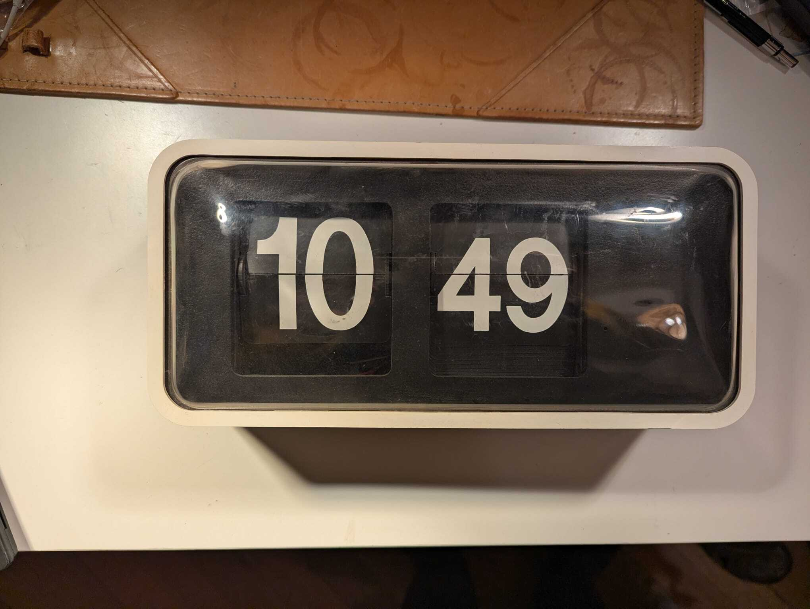
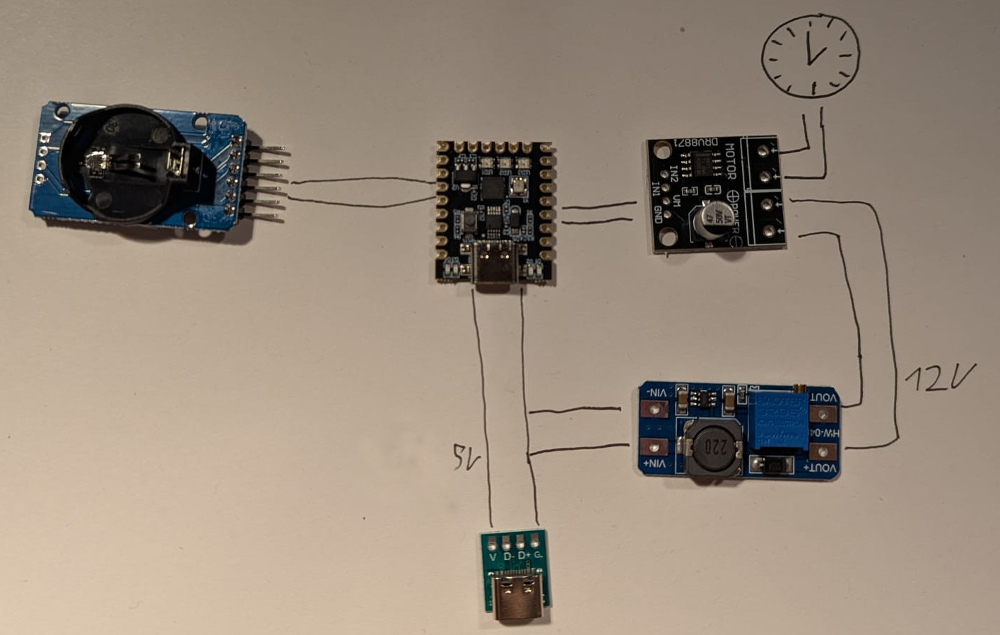

# Repair Flip Clock 
I acquired multiple of what I think are bodet flip clocks. These are so-called slave clocks, which need a master clock to function. This master clock provides every minute a specific voltage to the slave clock to tell it to increase the time. Because I don't have a master clock, this is what I needed to build to make them function again. Here I want to document the process. 

## Parts
Those were the final parts that worked. In some pictures you may see different ones because I also tried out some other ones but, for some reason, decided to use these in the end.  
**Microcontorler**:  
Super Mini Nano V3 Atmega328P    
Every other microcontroller should also work. Initially, I tried an ESP32 but it's not necessary to use such a powerful board.
**Motor Driver**:  
DRV8871 DC 6,5–45  
**Clock module**:  
DS3231  
**Power**:  
USB-C female port   
MT3608 DC-DC  Step Up Module

## Wiring
Here's a small sketch of the wiring. In the end, I also added a button to the microcontroller to forward the time.
  
The main component is the microcontroller, it receives power by the USB-C port. It is also connected to the clock module to tell the time. Then it has 2 pins connected to the motor driver to tell it when and how to drive the motor.  
The motor driver receives 12V from the step-up converter, which is also connected to the USB-C port.   
I also tried to add batteries to the clock to make it battery-powered but was not happy with how often I needed to change it, that why I removed those again.

## Functioning of the clock
In the manual you can see how to wire the clock to work with 12 V. For that, you connect the 4 cables in pairs of 2 connecting the ones next to each other. Those then can receive 12V to change the time. To achieve that, you need to switch the polarity of the power each time you change the time.

Here you can see the clock after the modification. The motor of the clock is on the right side. Therefore, I placed all electronics on the left side and passed two wires below.

This is the back side of the clock; here I placed a USB-C port to power it. I also attached a button to manually set the time.

This is a close-up of the USB-C port. I had to feed the wires through the already existing holes in the clock.

## Code Explaind
In the main.cpp file, you can find the code for the project. I now briefly explain the function.    
I use the RTClib.h library to use the clock module, from that I receive the current time and extract the seconds. Then every 60 seconds, I power on the motor for 200 ms, then switch the polarity of the motor, and leave it on for another 200 ms. After that I turn the motor off and wait for the next minute to pass.   
I also added that if you press the button, then it will forward one minute. That's handy when setting the time.

## Helpful links
https://github.com/jank/Bodet
https://www.haraldkreuzer.net/en/news/controlling-bodet-flip-display-slave-clock-esp32
https://hackaday.io/project/186457-bodet-flip-clock-hacked-back-to-the-present
https://www.flipclockfans.com/forum/forum/clock-show-and-tell/clock-restoration-and-repair/4484-bodet-flip-clock-questions